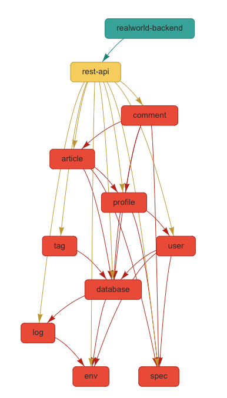
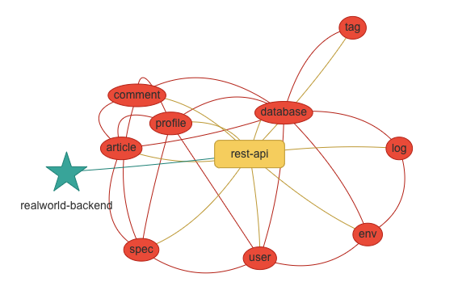
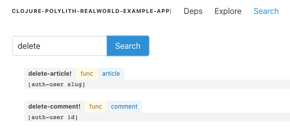

# polylith-viz

polylith-viz is a tool that you can drop into your polylith application to provide

* Component dependency visualisation
* Interface exploration
* Interface full text search

You can find out more about  [here](https://polylith.gitbook.io/polylith)

## Usage

### Installation

1.Add the polylith-viz dependecy to your development deps.edn and start your repl

```clojure
 :aliases
  {:dev
   {:extra-deps
    {sneakypeet/polylith-viz
     {:git/url   "https://github.com/SneakyPeet/polylith-viz"
      :sha       "INSERT_LATEST_SHA_HERE"
      :deps/root "projects/polylith-viz"}}}}
```

2. Ensure poly tool is installed

polylith-viz will automatically regenerate the workspace.edn file on every request. This can be turned off with options.

### Dev server

Run the poly-viz server from your repl. Any changes to your polylith system will reflect on page refresh

Start the polylith server

```clojure
(poly-viz.server.core/start)

```

You can pass in various options when starting the server (see [available options](#available-options))

```clojure
(poly-viz.server.core/start
 :ws-path "/path/to/workspace.edn"
 :port 3000)
```


### Static Site

You can use `poly-viz.server.static/html` to generate a static page. You can setup your CI to build and deploy this anywhere you like for easy reference.

Writing the code that saves the html to a file is left to you, but here is an example

```clojure
(defn build-pages
  "assumes you have already ran `poly ws out:polyws.edn`"
  []
  (let [f (io/file "public/index.html")]
    (io/make-parents f)
    (spit f (static/html :include-dev-projects? true
                         :rebuild-ws-file-before-generate? false))))
```


## Dependency network

polylith-viz uses [visjs.org's](https://visjs.org/) network library to generate a dependency network diagram for projects, bases and components.



The network layout and style can be modified by passing in the different options when starting the server.


```clojure
(start
 :brick-options {:component {:nodes {:color "#ED553B"}
                             :edges {}}
                 :base {:nodes {:color "#F6D55C"
                                :shape "box"}
                        :edges {}}
                 :project {:nodes {:color "#3CAEA3"
                                   :shape "star"}
                           :edges {}}}

 :vis-options {:layout {:hierarchical {:enabled false}}
               :edges {:arrows nil
                       :smooth true}

               :nodes {:shape "ellipse"
                       :margin {:top 10 :bottom 10 :left 20 :right 20}}})
```



## Interface Search and Explore
polylith-viz makes it easy to explore interfaces as well as allows full text search on interfaces



## Available Options

|  Option |  Description | Default|
|---|---|---|
|:ws-path  | The path to your generated workspace.edn file| "polyws.edn"|
|:output-ws-on-request? | Rebuilds the workspace file on every page refresh | true |
|:ws-shell-cmd | The poly tool command that rebuilds the workspace file when :output-ws-on-request? is true | ["poly" "ws" "out:polyws.edn"] |
|:port | Server port | 8087 |
|:browse? | Opens the browser on start| true|
|:include-dev-project? | Includes the dev project in analysis | false |
|:brick-options | [visjs.org](https://visjs.org/) network options for [brick nodes](https://visjs.github.io/vis-network/docs/network/nodes.html) and [edges](https://visjs.github.io/vis-network/docs/network/edges.html)| poly-viz.vis-network.interface/default-brick-vis-options|
|:brick-levels | When using the [visjs.org](https://visjs.org/) network hierarchical layout, a bricks level is determined by this starting-level + number of other bricks depending on it.| poly-viz.vis-network.interface/brick-hierarchical-layout-starting-levels|
|:vis-options | [visjs.org](https://visjs.org/) network options| poly-viz.vis-network.interface/default-vis-options|
